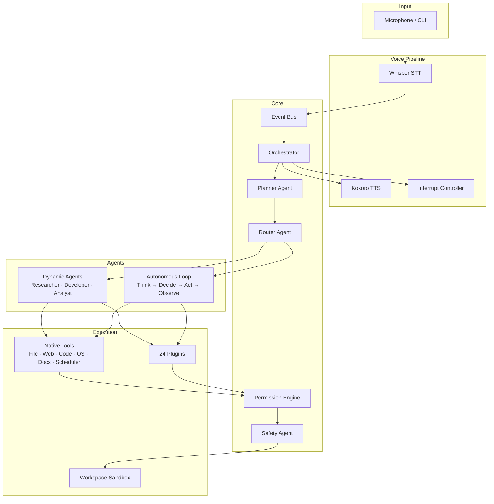

<p align="center">
  
</p>

<h1 align="center">VoiceOS</h1>
<p align="center">
  <strong>A Voice + CLI Driven Multi-Agent Operating System with Autonomous AI Capabilities</strong>
</p>

<p align="center">
  
  
  
  
  
  
</p>

---

## What is VoiceOS?

VoiceOS is a **locally-run, voice-controlled AI operating system interface** built in Python. You speak (or type) natural-language commands; VoiceOS listens, plans, routes work to specialized AI agents, executes tools on your machine, and responds by voice or text — with permission checks and sandboxing throughout.

It is **not a replacement for Windows/macOS/Linux** — it is a **control layer on top of your OS**: an always-on assistant that can open apps, automate the desktop, research the web, write code, manage files, and run multi-step autonomous workflows — all from your machine, with local models where possible.

> **Voice-Controlled · Multi-Agent · Autonomous AI · Permission-Gated · Local-First**

---

## Key Features

| Feature | Description |
|---------|-------------|
| 🎤 **Voice + CLI Input** | Speak or type commands; real-time STT via Whisper (`faster-whisper`) |
| 🧠 **Multi-Agent System** | Core agents (Planner, Router, Safety) + YAML-defined dynamic roles |
| 🤖 **Autonomous Loop** | Iterative `think → decide → act → observe` execution for complex goals |
| 🔎 **Web Research Engine** | DuckDuckGo search + BeautifulSoup scraping + multi-source synthesis |
| 💻 **Code Development** | Generate, edit, execute, and debug scripts in a sandboxed workspace |
| 🛠️ **OS Automation** | Open apps, switch windows, control keyboard/clipboard, take screenshots |
| 🔌 **Plugin Marketplace** | 24 built-in plugins (browser, memory, Telegram, WhatsApp, office, etc.) |
| 🔐 **Safety Architecture** | Permission-gated (LOW/MEDIUM/HIGH), sandbox isolation, full audit logging |
| ⚡ **Distributed Workers** | Optional Redis queue + role-based worker processes for scaled execution |
| 🗣️ **TTS Output** | Spoken responses via Kokoro TTS (Coqui fallback) |

---

## Architecture



---

## Execution Modes

| Mode | Latency | Trigger | Description |
|------|---------|---------|-------------|
| **Simple** | < 1s | Direct command | Direct tool execution — open app, type text, screenshot |
| **Complex** | 1–30s | Research/dev tasks | Dynamic agent (Researcher, Developer, Analyst) |
| **Autonomous** | 1–5 min | Multi-step goals | Iterative agent loop with tool generation and self-correction |

---

## Project Structure

```
project/
├── main.py                    # Entry point — wires all components
├── config/
│   └── voiceos.yaml           # Main configuration
├── agents/
│   ├── core/                  # Planner, Router, Safety agents
│   ├── autonomous/            # Autonomous agent loop
│   ├── dynamic/               # Dynamic agent executor
│   └── roles/                 # YAML-defined agent roles (researcher, developer, analyst)
├── core/
│   ├── orchestrator.py        # System orchestrator
│   ├── config.py              # Configuration management
│   ├── logger.py              # Structured logging
│   ├── security.py            # Security system
│   ├── events/                # EventBus, event types, handlers
│   ├── cli/                   # VoiceCLIIntegration, response builder
│   ├── plugins/               # Plugin lifecycle, registry, config, monitoring
│   ├── helpers/               # Helper bridge and discovery
│   ├── extensions/            # Hook-based extension points
│   ├── integration/           # Integration patterns and controlled execution
│   ├── monitoring/            # Performance monitor, error recovery
│   ├── pipelines/             # Stream pipeline
│   └── system/                # Unified dashboard, system verification
├── tools/
│   ├── file_tools/            # EnhancedFileManager
│   ├── web_tools/             # BrowserTool (search, scrape)
│   ├── code_tools/            # CodeExecutor (sandboxed)
│   ├── document_tools/        # DocumentProcessor (PDF, DOCX, TXT)
│   ├── scheduler_tools/       # TaskScheduler
│   └── os_control/            # App launch, window control, keyboard, clipboard
├── audio/                     # VoicePipeline, microphone, streaming STT
├── tts/                       # TTS engine factory (Kokoro / Coqui)
├── interrupt/                 # InterruptController, SpeechState, TTSController
├── listener/                  # BackchannelEngine, speech activity detection
├── llm/                       # LLMClient, ConversationEngine, model paths
├── memory/                    # MemoryManager, entity extraction
├── model_manager/             # Auto model download and hardware detection
├── permissions/               # PermissionEngine, audit logging
├── plugins/                   # 24 bundled plugins
├── helpers/                   # Agent Zero UI server, settings, extensions
├── workers/                   # agent_worker.py (distributed mode)
├── workspace/                 # Sandboxed task workspaces (task_[id]/)
├── scripts/                   # verify_setup.py, install_deps.py
├── docs/                      # Full documentation
├── Dockerfile                 # Main service container
├── Dockerfile.worker          # Worker service container
└── docker-compose.yml         # Full stack (VoiceOS + Redis + Postgres)
```

---

## AI Models (Local-First)

`ModelManager` auto-detects available RAM and downloads appropriate models on first run:

| Component | Technology | Notes |
|-----------|-----------|-------|
| **STT** | OpenAI Whisper via `faster-whisper` | `base` by default; configurable |
| **TTS** | Kokoro (primary), Coqui (fallback) | Kokoro works on all platforms |
| **LLM** | Mistral-7B-Instruct (GGUF) or Ollama | Chosen by available RAM |
| **Embeddings** | sentence-transformers + ChromaDB | Used by memory plugin |

Cloud API keys (OpenAI, Anthropic) are optional fallbacks configured in `.env`.

---

## Safety Model

Every action passes through a four-stage safety pipeline:

```
Agent → Safety Check → Permission Gate → Execution → Audit Log
```

| Level | Examples | Behavior |
|-------|---------|---------|
| **LOW** | Read files, list directory, web search | Silent allow |
| **MEDIUM** | Write files, open apps, web scraping | User confirmation |
| **HIGH** | Delete files, execute code, system ops | Explicit approval required |

All operations are confined to `workspace/task_[id]/` directories, preventing agents from touching arbitrary system paths.

---

## Quick Start

### Local (Recommended)

```bash
# 1. Clone the repository
git clone https://github.com/AjayRajan05/VoiceOS.git
cd VoiceOS/project

# 2. Create and activate virtual environment
python -m venv .venv
.venv\Scripts\activate          # Windows
# source .venv/bin/activate     # macOS / Linux

# 3. Install dependencies
pip install -r requirements.txt

# 4. Configure environment
cp .env.example .env
# Edit .env — set LLM_ENDPOINT, API keys, etc.

# 5. Verify setup
python scripts/verify_setup.py

# 6. Run VoiceOS
python main.py                   # Hybrid mode (voice + CLI)
python main.py --mode voice      # Voice only
python main.py --mode cli        # CLI only
python main.py --status          # System health check
python main.py --test            # Run system tests
```

### Docker

```bash
# Build and run full stack (VoiceOS + Redis + Postgres)
docker-compose up --build

# Run in detached mode
docker-compose up -d

# Run with GPU support
docker-compose --profile gpu up

# Access an interactive shell
docker-compose exec voiceos bash
```

Models persist in `./models/`, workspaces in `./workspace/`, logs in `./logs/`.

---

## Example Commands

**Simple (instant):**
```
"Open Chrome"
"Take a screenshot"
"Type hello world"
"Switch window"
```

**Complex (agent-driven, seconds):**
```
"Research the latest developments in quantum computing"
"Write a Python function to parse CSV files"
"Summarize the latest AI news"
```

**Autonomous (multi-step loop, minutes):**
```
"Build a complete web scraper for product prices and analyze trends"
"Automate my daily sales report generation"
"Create a REST API with Flask and write tests for it"
```

**IDE workflow:**
```
"Open VS Code"
"Create file workspace/hello.py with a hello world script"
"Run file workspace/hello.py"
```

---

## Plugins (24 Built-in)

| Plugin | Function |
|--------|---------|
| `_browser` | Playwright-based web browsing |
| `_memory` | Long-term recall with vector search (ChromaDB) |
| `_code_execution` | Sandboxed script execution |
| `_text_editor` | File creation and editing bridge |
| `_office` | Word/Excel/PowerPoint processing |
| `_telegram_integration` | Telegram bot integration |
| `_whatsapp_integration` | WhatsApp messaging |
| `_email_integration` | Email send/receive |
| `_model_config` | LLM provider configuration |
| `_skills` | Custom skill definitions |
| `_marketplace` | Plugin discovery and install |
| `_plugin_installer` | Automated plugin deployment |
| `_chat_branching` | Conversation branching |
| `_chat_compaction` | Conversation history management |
| `_a0_connector` | Agent Zero UI server bridge |
| `_discovery` | Extension auto-discovery |
| `_error_retry` | Automatic error retry |
| `_infection_check` | Security scanning |
| `_oauth` | OAuth authentication |
| `_onboarding` | First-run setup wizard |
| `_plugin_scan` | Plugin security scanner |
| `_plugin_validator` | Plugin compatibility validation |
| `_promptinclude` | Prompt template inclusion |
| `_time_travel` | Conversation history navigation |

---

## Configuration

Key environment variables (see [`.env.example`](.env.example)):

```bash
# LLM backend (Ollama or GGUF)
LLM_ENDPOINT=http://localhost:11434/api/generate
LLM_MODEL=mistral

# Voice models
WHISPER_MODEL=base
TTS_MODEL=tts_models/en/ljspeech/tacotron2-DDC

# Optional cloud fallback
OPENAI_API_KEY=
ANTHROPIC_API_KEY=

# Execution mode (local | queued for distributed)
EXECUTION_MODE=local
REDIS_URL=redis://localhost:6379/0
```

---

## Distributed Mode

For large workloads, switch to queued execution with worker processes:

```bash
# In config/voiceos.yaml or .env:
# execution_mode: queued

# Start worker(s) with specific agent roles
python workers/agent_worker.py --roles researcher,developer,analyst
```

Workers register with heartbeat; the orchestrator routes tasks via Redis queue.

---

## Roadmap

- [x] Native VoiceOS tools integration (file, web, code, document, scheduler, OS)
- [x] Permission-based safety system with audit logging
- [x] Multi-agent execution modes (simple / complex / autonomous)
- [x] Parallel multi-agent workflows with meta-planner
- [x] Plugin marketplace (24 built-in plugins)
- [x] Distributed execution (Redis queue + role-based workers)
- [x] Voice-controlled IDE v1 (text_editor bridge, file creation)
- [x] Interrupt-aware TTS (voice can be interrupted mid-sentence)
- [ ] Dedicated React/Next.js GUI dashboard
- [ ] Deep VS Code extension integration (LSP, git, debugger)
- [ ] Wake-word always-on listening
- [ ] Real-time multi-user collaboration

---

## Documentation

| Document | Description |
|---------|-------------|
| [Setup Guide](docs/setup.md) | Installation, configuration, and troubleshooting |
| [Architecture](docs/architecture.md) | System design, layers, and data flow |
| [Agent System](docs/agents.md) | Core agents, dynamic roles, autonomous loop |
| [Usage Guide](docs/usage.md) | Commands, workflows, and best practices |
| [Tool API Reference](docs/tool_api.md) | Native tool classes and methods |
| [API Reference](docs/api_reference.md) | Full module and class API |
| [Memory Design](docs/memory_design.md) | Memory storage, retrieval, and management |
| [Core Integration Systems](docs/core_integration_systems.md) | Plugins, helpers, extensions, dashboard |
| [Docker Instructions](docker-instructions.md) | Full Docker/Compose setup guide |

---

## Contributing

Contributions are welcome. Please open an issue first to discuss significant changes.

```bash
# Run tests
python main.py --test
python -m pytest tests/
```

---

## License

MIT License - see [LICENSE](LICENSE) for details.
