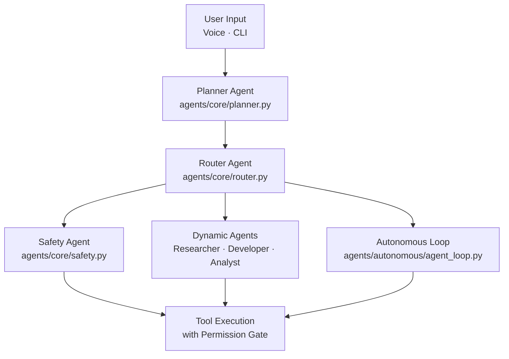
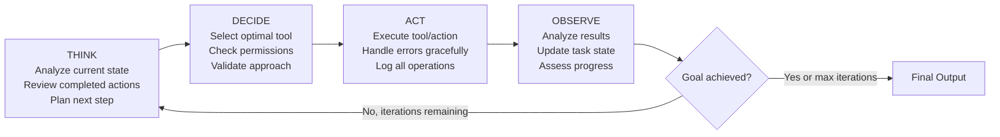

# 🤖 VoiceOS Agent System

VoiceOS uses a three-tier multi-agent system: **core agents** that always run, **dynamic agents** for domain-specific tasks, and an **autonomous agent loop** for open-ended goals.

---

## 🏛️ Agent Hierarchy



---

## 🧠 Core Agents

Core agents are always active and form the backbone of every request.

### Planner Agent

**Location**: `agents/core/planner.py`

The Planner analyzes every user input and classifies it into an execution mode:

| Classification | Latency | Criteria | Examples |
|---------------|---------|---------|---------|
| **Simple** | < 1s | Single direct action | "Open Chrome", "Take screenshot", "Type hello" |
| **Complex** | 1–30s | Multi-step, domain knowledge needed | "Research AI trends", "Write a scraper" |
| **Autonomous** | 1–5 min | Open-ended goal, iterative work | "Build a complete data pipeline" |

**Key responsibilities:**
- Parse natural language intent
- Assess task complexity and resource requirements
- Generate a `TaskPlan` with classified type, estimated time, and resource needs
- Detect compound commands (multiple goals in one sentence) for the Meta-Planner

**Routing logic (simplified):**
```python
def analyze_input(user_input: str) -> TaskPlan:
    intent = llm.classify(user_input)
    if intent.is_direct_action:
        return TaskPlan(type="simple", tool=intent.tool)
    elif intent.requires_research_or_code:
        return TaskPlan(type="complex", domain=intent.domain)
    else:
        return TaskPlan(type="autonomous", goal=user_input)
```

---

### Router Agent

**Location**: `agents/core/router.py`

The Router directs the classified task to the right executor:

```python
if task.type == "simple":
    route_to_tool_registry(task.tool)
elif task.type == "complex":
    agent = select_dynamic_agent(task.domain)   # researcher / developer / analyst
    route_to_dynamic_agent(agent, task)
elif task.type == "autonomous":
    route_to_autonomous_loop(task.goal)
```

For compound goals (e.g., "research X and then write code for it"), the Router invokes the **Meta-Planner**, which:
1. Splits the goal into sub-tasks
2. Executes sub-tasks in parallel where possible
3. Passes artifacts (e.g., research results) between agents

---

### Safety Agent

**Location**: `agents/core/safety.py`

The Safety Agent runs as a gatekeeper before any tool execution:

**Responsibilities:**
- Assess the risk level of a proposed action
- Enforce blocklists (dangerous file paths, forbidden system operations)
- Validate tool inputs for malicious patterns
- Request user confirmation for HIGH-level operations

**Safety checks performed:**
- Path traversal detection (e.g., `../../etc/passwd`)
- Dangerous code pattern scanning (e.g., `import os; os.system(...)`)
- Blocked file path enforcement (system directories, config files)
- Resource limit enforcement

All blocked actions are logged to the audit log with the reason for rejection.

---

## 🎭 Dynamic Agents

Dynamic agents are **role-based specialists** defined through YAML configuration and prompt templates. They are created on demand for complex tasks.

### Directory Structure

```
agents/roles/
├── researcher/
│   ├── agent.yaml          # Agent configuration
│   ├── prompt.txt          # System prompt template
│   └── tools.yaml          # Preferred tools and priorities
├── developer/
│   ├── agent.yaml
│   ├── prompt.txt
│   └── tools.yaml
└── analyst/
    ├── agent.yaml
    ├── prompt.txt
    └── tools.yaml
```

### Researcher Agent

**Specialization**: Information gathering, web research, and synthesis

| Capability | Tools Used |
|-----------|-----------|
| Web search (DuckDuckGo) | `BrowserTool.search_web()` |
| Page scraping | `BrowserTool.scrape_content()` |
| Document analysis | `DocumentProcessor.extract_text()` |
| Report writing | `EnhancedFileManager.write_file()` |

**Example YAML:**
```yaml
name: "researcher"
version: "1.0.0"
description: "Specialized in web research and information synthesis"
permission_level: "medium"
max_execution_time: 300

tools:
  - browser_tool
  - document_processor
  - enhanced_file_manager

capabilities:
  - web_research
  - source_verification
  - data_synthesis
  - citation_management
```

---

### Developer Agent

**Specialization**: Code generation, file manipulation, and debugging

| Capability | Tools Used |
|-----------|-----------|
| Code generation | LLM + `EnhancedFileManager.write_file()` |
| Code execution | `CodeExecutor.execute_code()` |
| File editing | `EnhancedFileManager.read_file()` / `write_file()` |
| Documentation lookup | `BrowserTool.scrape_content()` |

**Workflow example:**
```
1. Receive task: "Write a Python script to parse CSV"
2. Generate code using LLM
3. Write to workspace/task_id/code/csv_parser.py
4. Execute code to test output
5. Fix errors if any (up to 3 retry cycles)
6. Return path to final script
```

---

### Analyst Agent

**Specialization**: Data processing, pattern analysis, and report generation

| Capability | Tools Used |
|-----------|-----------|
| CSV/JSON analysis | `CodeExecutor` (pandas/numpy scripts) |
| Document processing | `DocumentProcessor.analyze_document()` |
| Report generation | `EnhancedFileManager.write_file()` |
| Visualization | `CodeExecutor` (matplotlib scripts) |

---

### Creating Custom Agent Roles

Add a new directory under `agents/roles/` with the following files:

**`agent.yaml`:**
```yaml
name: "data_scientist"
version: "1.0.0"
description: "Specialized in statistical analysis and ML model building"
permission_level: "medium"
max_execution_time: 600          # seconds
max_memory_usage: 1024           # MB

tools:
  - code_executor
  - enhanced_file_manager
  - document_processor

capabilities:
  - statistical_analysis
  - machine_learning
  - data_visualization
  - model_evaluation

constraints:
  - workspace_only              # Restrict all file access to workspace
  - no_network_access           # No web access
```

**`prompt.txt`:**
```
You are a data scientist agent specializing in statistical analysis and machine learning.

Your primary responsibilities:
- Analyze datasets and identify patterns
- Build and evaluate ML models
- Generate clear reports with visualizations

Available tools: {tools_list}

Safety constraints: {constraints}

Always validate data quality before analysis. Request permission before running
computationally expensive operations. Store all outputs in the workspace.
```

---

## 🤖 Autonomous Agent Loop

The autonomous agent is the most powerful execution mode. It handles open-ended goals through an iterative reasoning cycle.

**Location**: `agents/autonomous/agent_loop.py`

### Execution Cycle



**Loop parameters:**
- Maximum iterations: **20**
- Maximum total time: **~5 minutes**
- Error retry per action: **3 attempts**

### Think Phase

- Load current task state and memory context
- Review all completed actions and their outcomes
- Identify what remains to accomplish
- Reason about the best next step given available tools and constraints

### Decide Phase

- Select the specific tool and method to call
- Verify the tool is registered and available
- Check permission requirements before calling
- Assess potential risks and prepare fallback strategies

### Act Phase

- Execute the chosen tool with parameters
- Apply all safety validations through `PermissionEngine` and `Safety`
- Handle exceptions and partial failures
- Log every action with full context to the audit log

### Observe Phase

- Analyze the action's result (success, partial, or failure)
- Update the working memory with new information
- Assess progress toward the original goal
- Decide whether to continue iterating or conclude

### Dynamic Tool Generation

When no existing tool can accomplish a sub-task, the autonomous agent can **generate new tools on the fly**:

```
1. Agent identifies a gap in available tools
2. LLM generates a Python function to fill the gap
3. Function is written to workspace/task_id/tools/custom_tool.py
4. Tool is validated and executed in the sandbox
5. Result is incorporated into the task context
```

---

## 📋 Agent Lifecycle

### Full Request Lifecycle

```python
# 1. Receive user input
task = planner.analyze_input("Build a web scraper for tech news")

# 2. Safety pre-check
safety.validate_task(task)

# 3. Route to executor
agent = router.route_task(task)

# 4. Create isolated workspace
workspace = WorkspaceManager.create(task.id)

# 5. Execute
result = await agent.execute(task, workspace)

# 6. Post-process
memory.store(task.id, result)
audit_log.write(task.id, result)

# 7. Deliver output
tts.speak(result.summary)
console.print(result.full_output)

# 8. Cleanup
workspace.cleanup_temp()
```

### Agent States

| State | Meaning |
|-------|---------|
| `IDLE` | Available for new tasks |
| `PLANNING` | Analyzing task and building plan |
| `EXECUTING` | Running tools/actions |
| `WAITING_PERMISSION` | Awaiting user approval |
| `COMPLETED` | Task finished successfully |
| `FAILED` | Unrecoverable error |
| `CANCELLED` | User cancelled mid-task |

---

## 📊 Agent Performance Metrics

The system tracks per-agent metrics available via `python main.py --status`:

| Metric | Description |
|--------|-------------|
| `total_requests` | Total tasks handled |
| `success_rate` | Percentage of successful completions |
| `avg_execution_time` | Mean time per task type |
| `error_rate` | Frequency of failures |
| `tool_usage` | Which tools each agent calls most |

---

## 🔧 Agent Configuration Reference

### Full `agent.yaml` Schema

```yaml
# Required
name: "agent_name"
version: "1.0.0"
description: "Agent description"

# Execution limits
permission_level: "medium"         # low | medium | high
max_execution_time: 300            # seconds (default: 300)
max_memory_usage: 512              # MB (default: 512)
max_iterations: 20                 # autonomous loop only (default: 20)

# Tools (ordered by priority)
tools:
  - tool_name:
      priority: "high"             # high | medium | low
      required: true               # fail if tool unavailable
  - another_tool:
      priority: "medium"
      required: false

# Capabilities exposed to the router
capabilities:
  - web_research
  - code_generation

# Constraints
constraints:
  - workspace_only                 # All file access confined to workspace
  - no_network_access              # Block all web tool calls
  - read_only_files                # Prevent file writes

# Memory and learning
memory:
  enabled: true
  store_context: true
  retrieve_relevant: true
```

---

## 🔍 Debugging Agent Execution

### View Agent Logs

```bash
# Real-time agent operation log
Get-Content workspace/logs/agent_operations.log -Wait   # Windows
tail -f workspace/logs/agent_operations.log              # Linux/macOS
```

### Run with Debug Logging

```bash
LOG_LEVEL=DEBUG python main.py --mode cli
```

### Check System Status (includes agent metrics)

```bash
python main.py --status
```

### Run System Tests

```bash
python main.py --test
```
