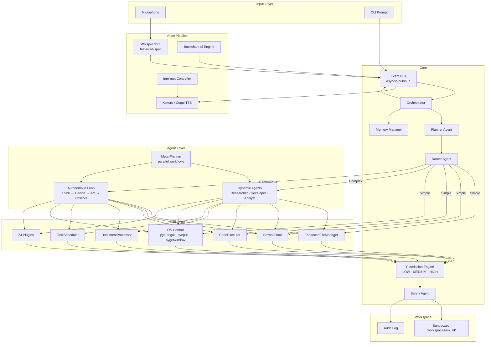
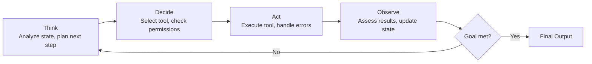
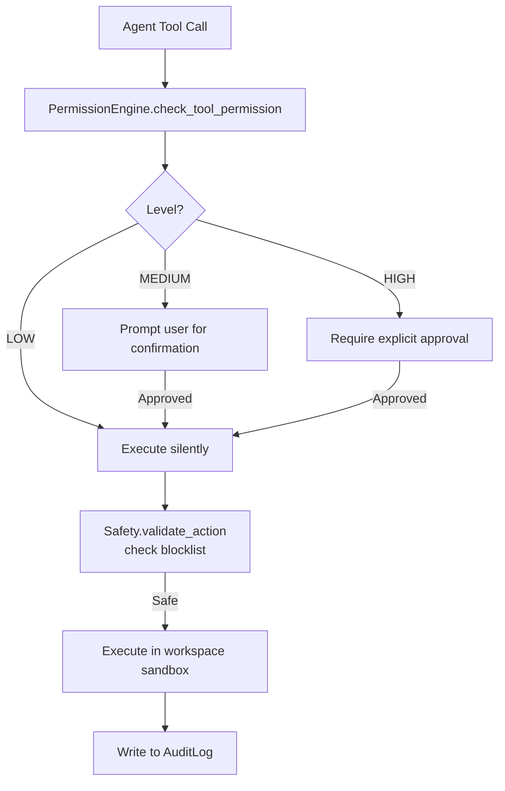

# 🧠 VoiceOS Architecture

VoiceOS is built on a **hybrid multi-agent event-driven architecture**. This document explains every system layer — from voice input to tool execution and back — along with security, state management, and extensibility.

---

## 🏗️ System Overview



---

## 📚 Architecture Layers

### 1. Input Layer

Users interact via three modalities:

| Mode | Mechanism |
|------|-----------|
| **Voice** | Microphone → `VoicePipeline` → Whisper STT → Event Bus |
| **CLI** | Terminal prompt at `VoiceOS>` → Event Bus directly |
| **Hybrid** (default) | Both simultaneously; voice and CLI work in parallel |

The `VoicePipeline` (`audio/voice_pipeline.py`) captures raw audio, detects speech activity via `webrtcvad`, and feeds audio chunks to the streaming STT engine.

---

### 2. Voice Pipeline

| Component | File | Role |
|-----------|------|------|
| `VoicePipeline` | `audio/voice_pipeline.py` | Orchestrates microphone and STT |
| `StreamingSTT` | `audio/streaming_stt.py` | Real-time Whisper transcription |
| `BackchannelEngine` | `listener/backchannel_engine.py` | Active listening signals |
| `InterruptController` | `interrupt/interrupt_controller.py` | Detects user interruptions mid-TTS |
| `SpeechState` | `interrupt/speech_state.py` | Tracks whether TTS is speaking |
| `TTSController` | `interrupt/tts_controller.py` | Routes text to TTS engine |
| TTS Engine | `tts/engine_factory.py` | Kokoro (default) or Coqui factory |

**Interrupt handling**: If the user begins speaking while TTS is playing, `InterruptController` signals `TTSController` to stop immediately, enabling natural conversation flow.

---

### 3. Event Bus

The **Event Bus** (`core/events/event_bus.py`) is the central nervous system of VoiceOS. All components communicate through it rather than direct coupling:

```
Component A --[publish event]--> EventBus --[notify subscribers]--> Component B
```

Key event types (`core/events/events.py`):

| Event | Publisher | Subscriber |
|-------|-----------|-----------|
| `USER_VOICE_INPUT` | VoicePipeline | Orchestrator |
| `USER_CLI_INPUT` | VoiceCLIIntegration | Orchestrator |
| `ORCHESTRATOR_RESPONSE` | Orchestrator | TTSController, CLI |
| `TASK_STARTED` | Orchestrator | EventHandlers |
| `TASK_COMPLETED` | Orchestrator | EventHandlers, Memory |
| `INTERRUPT_REQUESTED` | InterruptController | TTSController |
| `TTS_STARTED` / `TTS_STOPPED` | TTSController | SpeechState |

This design allows any component to be replaced or extended without changing others.

---

### 4. Planning & Routing Layer

Every user command passes through two core agents before execution:

#### Planner Agent (`agents/core/planner.py`)

Analyzes the input and classifies it into an execution mode:

| Classification | Criteria | Example |
|---------------|---------|---------|
| **Simple** | Single, direct action | "Open Chrome", "Take a screenshot" |
| **Complex** | Requires research or multi-step reasoning | "Research AI trends", "Write a scraper" |
| **Autonomous** | Open-ended goal needing iteration | "Build and test a full web scraper" |

#### Router Agent (`agents/core/router.py`)

Routes the classified task to the appropriate executor:

```python
if task.type == "simple":
    route_to_tool_registry()
elif task.type == "complex":
    route_to_dynamic_agent(task.domain)   # researcher | developer | analyst
elif task.type == "autonomous":
    route_to_autonomous_loop()
```

For compound phrases (e.g., "research X then write code for Y"), the **Meta-Planner** splits the goal into parallel sub-tasks and coordinates artifact handoff between agents.

---

### 5. Agent Layer

#### Core Agents (always-on)

| Agent | File | Role |
|-------|------|------|
| Planner | `agents/core/planner.py` | Task classification and planning |
| Router | `agents/core/router.py` | Task routing and agent selection |
| Safety | `agents/core/safety.py` | Risk assessment and permission checks |

#### Dynamic Agents (YAML-defined roles)

Defined in `agents/roles/[role]/agent.yaml`. Three built-in roles:

| Role | Specialization | Primary Tools |
|------|---------------|--------------|
| `researcher` | Web research and synthesis | BrowserTool, DocumentProcessor |
| `developer` | Code generation and debugging | CodeExecutor, EnhancedFileManager |
| `analyst` | Data analysis and reporting | DocumentProcessor, CodeExecutor |

Custom roles can be added by creating a new directory under `agents/roles/`.

#### Autonomous Agent Loop (`agents/autonomous/agent_loop.py`)

The autonomous agent runs an iterative `Think → Decide → Act → Observe` cycle (up to 20 iterations, ~5 minutes):



The autonomous agent can also **generate new tools on the fly** using the LLM and execute them in the sandboxed workspace.

---

### 6. Tool Layer

All tools are registered in `ToolRegistry` and follow the same permission-gated interface.

#### Native VoiceOS Tools

| Tool | Class | Location | Permission |
|------|-------|----------|-----------|
| File management | `EnhancedFileManager` | `tools/file_tools/` | LOW–HIGH |
| Web browsing | `BrowserTool` | `tools/web_tools/` | LOW–MEDIUM |
| Code execution | `CodeExecutor` | `tools/code_tools/` | HIGH |
| Document processing | `DocumentProcessor` | `tools/document_tools/` | LOW–MEDIUM |
| Task scheduling | `TaskScheduler` | `tools/scheduler_tools/` | MEDIUM |
| OS control | Various | `tools/os_control/` | MEDIUM–HIGH |

#### OS Control

The OS control module (`tools/os_control/`) wraps:
- **`pyautogui`** — keyboard and mouse simulation
- **`pynput`** — low-level input listening
- **`pygetwindow`** — window enumeration and focus
- **`pyperclip`** — clipboard read/write
- **`psutil`** — process management

All OS operations require MEDIUM or HIGH permission and explicit user approval.

#### Plugin Tools

24 plugins in `plugins/` extend VoiceOS with additional capabilities. Plugins are discovered and loaded by `PluginLoader` at startup.

---

### 7. Safety & Permission Layer

Every tool call is gated through the `PermissionEngine` (`permissions/`):

```
Agent → PermissionEngine.check_tool_permission(level) → Safety.validate_action() → Execute → AuditLog
```

| Level | Decorator | Examples | Approval |
|-------|-----------|---------|---------|
| `LOW` | `@check_permission(PermissionLevel.LOW)` | read_file, search_web | Silent |
| `MEDIUM` | `@check_permission(PermissionLevel.MEDIUM)` | write_file, open_page | User prompt |
| `HIGH` | `@check_permission(PermissionLevel.HIGH)` | delete_file, execute_code | Explicit approval |

The Safety Agent additionally validates actions against a blocklist of dangerous patterns (e.g., deleting system files, accessing paths outside workspace).

All operations are written to an **audit log** with timestamp, agent, tool, method, parameters, and outcome. Optional PostgreSQL persistence is available.

---

### 8. Workspace Layer

Agents never operate on arbitrary filesystem paths. All work is confined to isolated workspace directories:

```
workspace/
├── task_abc123/              # One directory per autonomous task
│   ├── code/                 # Generated scripts
│   ├── tools/                # Dynamically generated tools
│   ├── data/                 # Task input data
│   ├── output/               # Results and reports
│   └── logs/                 # Task-specific logs
├── shared/                   # Cross-task shared resources
└── temp/                     # Temporary files (auto-cleaned)
```

The `EnhancedFileManager` path-checks every file operation against the workspace root and raises `ValueError` for any path traversal attempt.

---

### 9. Memory System

`MemoryManager` (`memory/`) provides three tiers:

| Tier | Scope | Storage | TTL |
|------|-------|---------|-----|
| **Working Memory** | Current task | In-memory | End of task |
| **Short-Term Memory** | Current session | In-memory + file | 24 hours |
| **Long-Term Memory** | Persistent | File (JSON) + optional ChromaDB | Never |

Memory is wired into the `Orchestrator` via `EventHandlers`, which stores task outcomes and conversation context automatically.

---

### 10. Output Layer

Results are delivered through:

| Channel | Mechanism |
|---------|-----------|
| **TTS** | `TTSController` → Kokoro engine → system speakers |
| **CLI** | `VoiceConsole` rich text output at the terminal prompt |
| **Files** | Reports, code, and artifacts written to `workspace/task_[id]/output/` |

---

## 🔄 Complete Request Lifecycle

```
1. User speaks "Build a Python web scraper"
2. VoicePipeline → Whisper → "Build a Python web scraper" (text)
3. EventBus publishes USER_VOICE_INPUT
4. Orchestrator picks up the event
5. Planner classifies → "autonomous"
6. Router routes → AutonomousAgentLoop
7. Autonomous loop begins (up to 20 iterations):
   a. Think: analyze goal, plan scraper structure
   b. Decide: use CodeExecutor to generate scraper.py
   c. Act: execute code in workspace/task_xyz/
   d. Observe: check output, fix errors if any
   e. Decide: use BrowserTool to test against a URL
   f. Observe: confirm scraper works
8. Final Result published → ORCHESTRATOR_RESPONSE event
9. TTSController speaks: "I've built a web scraper at workspace/task_xyz/scraper.py"
10. CLI prints the full result
11. EventHandlers store outcome in MemoryManager
12. Audit log records all tool calls and permissions
```

---

## 🔐 Security Architecture

### Permission Flow



### Safety Measures Summary

- **Workspace isolation** — `ValueError` on path traversal
- **Input validation** — All tool inputs sanitized
- **Code scanning** — Dangerous imports/patterns blocked in `CodeExecutor`
- **Resource limits** — CPU, memory, and execution time caps in `controlled_execution.py`
- **Audit logging** — Every action logged with full context
- **Permission prompts** — User in control of MEDIUM/HIGH operations

---

## 📊 Core Integration Systems

The `core/` directory houses the integration framework in organized subdirectories:

```
core/
├── orchestrator.py            # Main system coordinator
├── config.py                  # Config management (singleton)
├── config_manager.py          # YAML config loading
├── logger.py                  # Structured JSON logger
├── security.py                # Security utilities
├── event.py                   # Event dataclass
├── events/                    # EventBus, Events enum, EventHandlers
├── cli/                       # VoiceCLIIntegration, VoiceConsole, CLIFlowReporter
├── plugins/                   # Plugin registry, lifecycle, config, error handling, monitoring
├── helpers/                   # Secure helper integration and bridge
├── extensions/                # Hook-based extension points and decorators
├── integration/               # Integration patterns and controlled execution
├── monitoring/                # PerformanceMonitor, ErrorRecovery
├── pipelines/                 # StreamPipeline
├── runtime/                   # RuntimeContext bootstrap
├── distributed/               # Redis queue and distributed runtime
└── system/                    # SystemVerification, UnifiedIntegrationDashboard
```

For detailed documentation on the integration framework, see [core_integration_systems.md](core_integration_systems.md).

---

## ⚡ Performance Characteristics

| Path | Typical Latency |
|------|----------------|
| Simple tool call (OS control) | < 200 ms |
| Complex task (dynamic agent) | 2–15 seconds |
| Autonomous task (multi-step) | 1–5 minutes |
| STT transcription (local Whisper base) | 0.5–2 seconds |
| TTS synthesis and playback start | < 500 ms |

### Optimization Strategies

- **Asyncio throughout** — All I/O is non-blocking
- **Event-driven decoupling** — No polling; reactive to events
- **Local models** — No network latency for core AI inference
- **Lazy loading** — Plugins and models loaded on demand
- **Result caching** — LLM response caching in memory

---

## 🧩 Design Principles

1. **Event-driven** — Components communicate via `EventBus`, not direct coupling
2. **Local-first** — Models run on your machine; cloud APIs are optional fallbacks
3. **Security-first** — Permissions, sandboxing, and audit logging at every layer
4. **Extensible** — Plugins, helpers, and extension hooks for any customization
5. **Hybrid execution** — Fast path for simple commands, full agent loop for complex work
6. **Fail-safe** — Errors are caught, logged, and recovered; never silent failures
