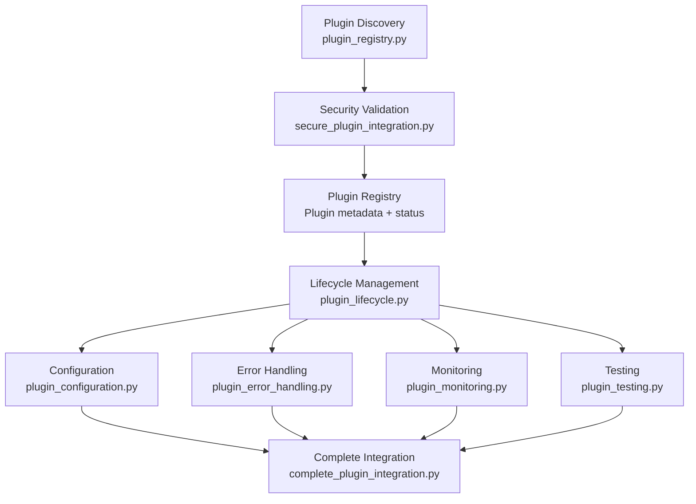
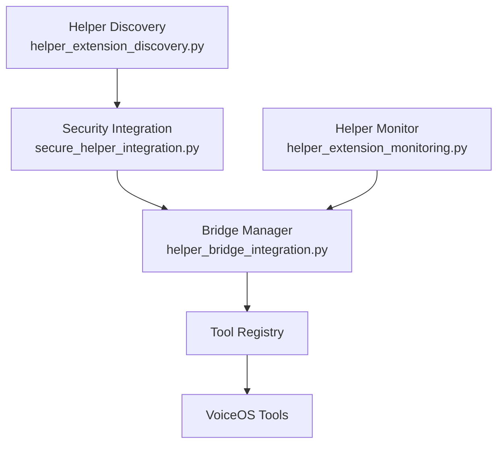
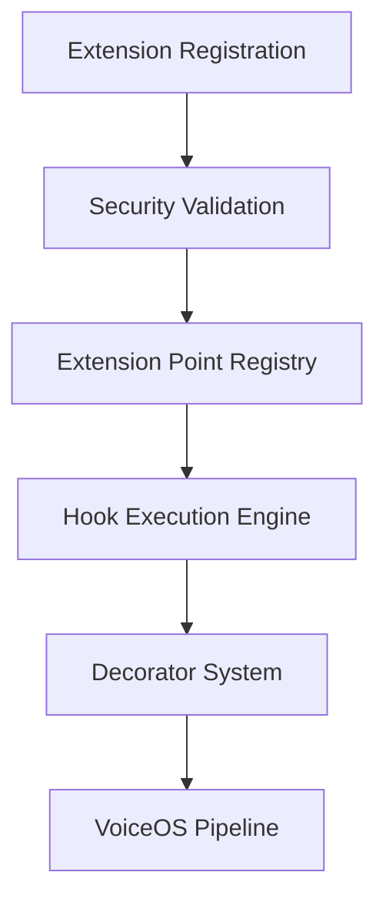

# 🔧 VoiceOS Core Integration Systems

This document covers VoiceOS's modular core integration framework: the **Plugin System**, **Helper System**, **Extension System**, **Integration Framework**, and **Unified Dashboard**.

---

## Table of Contents

- [Overview](#overview)
- [Plugin System](#-plugin-system)
- [Helper System](#-helper-system)
- [Extension System](#-extension-system)
- [Integration Framework](#-integration-framework)
- [Monitoring & Dashboard](#-monitoring--dashboard)
- [Writing a Plugin](#-writing-a-plugin)
- [Writing an Extension](#-writing-an-extension)
- [Writing a Helper](#-writing-a-helper)
- [Import Path Reference](#-import-path-reference)

---

## Overview

The `core/` directory organizes all integration systems into logical subdirectories:

```
core/
├── orchestrator.py            # Top-level coordinator
├── config.py                  # Config singleton
├── config_manager.py          # YAML config loading
├── logger.py                  # Structured logging
├── security.py                # Security utilities
├── event.py                   # Event dataclass
│
├── events/                    # Event system
│   ├── event_bus.py           # Async pub/sub EventBus
│   ├── events.py              # Events enum (all event type strings)
│   └── event_handlers.py      # Auto-wired event handlers (memory, logging)
│
├── cli/                       # Terminal interaction
│   ├── voice_cli_integration.py  # VoiceCLIIntegration (hybrid voice+CLI loop)
│   ├── response_builder.py       # Format agent responses for terminal
│   ├── console.py                # VoiceConsole (rich terminal output)
│   └── flow_reporter.py          # CLIFlowReporter (streams task progress)
│
├── plugins/                   # Plugin system (8 modules)
│   ├── startup.py             # initialize_voiceos_plugin_system()
│   ├── secure_plugin_integration.py
│   ├── plugin_registry.py
│   ├── plugin_lifecycle.py
│   ├── plugin_configuration.py
│   ├── plugin_error_handling.py
│   ├── plugin_monitoring.py
│   ├── plugin_testing.py
│   └── complete_plugin_integration.py
│
├── helpers/                   # Helper system (4 modules)
│   ├── secure_helper_integration.py
│   ├── helper_bridge_integration.py
│   ├── helper_extension_discovery.py
│   └── helper_extension_monitoring.py
│
├── extensions/                # Extension point system (2 modules)
│   ├── secure_extension_integration.py
│   └── extension_point_system.py
│
├── integration/               # Integration patterns (2 modules)
│   ├── integration_patterns.py
│   └── controlled_execution.py
│
├── monitoring/                # Monitoring (2 modules)
│   ├── performance_monitor.py
│   └── error_recovery.py
│
├── pipelines/                 # Stream processing (1 module)
│   └── stream_pipeline.py
│
├── runtime/                   # Runtime bootstrap
│   └── bootstrap.py           # build_runtime_context()
│
├── distributed/               # Distributed workers
│   └── runtime.py             # configure_distributed_runtime()
│
└── system/                    # Management tools (2 modules)
    ├── system_verification.py
    └── unified_integration_dashboard.py
```

---

## 🔌 Plugin System

The plugin system provides a **security-first, lifecycle-managed** way to extend VoiceOS with external capabilities.

### Architecture



### Plugin Lifecycle States

```
DISCOVERED → LOADING → LOADED → INITIALIZING → ACTIVE → SUSPENDED → UNLOADED
```

### Components

#### 1. `core/plugins/startup.py` — System Startup

Called once at application start to initialize the entire plugin subsystem:

```python
from core.plugins.startup import initialize_voiceos_plugin_system

# Called in main.py during startup
plugin_info = await initialize_voiceos_plugin_system()
print(f"Discovered: {plugin_info['discovered']} plugins")
print(f"Registry entries: {plugin_info['registry_total']}")
```

---

#### 2. `core/plugins/secure_plugin_integration.py` — Security Validation

Validates every plugin for security compliance before loading:

```python
from core.plugins.secure_plugin_integration import get_secure_plugin_adapter

adapter = get_secure_plugin_adapter()

# Validate plugin code for security issues
validation = await adapter.validate_plugin("/path/to/my_plugin")
if validation.is_safe:
    plugin = await adapter.load_plugin_securely("/path/to/my_plugin")
else:
    print(f"Security issues: {validation.violations}")
```

**Security checks performed:**
- Dangerous import scanning (`os.system`, `subprocess`, `__builtins__`)
- Network access pattern detection
- File system access pattern validation
- Resource usage estimation

---

#### 3. `core/plugins/plugin_registry.py` — Discovery & Registration

Manages the central registry of all known plugins:

```python
from core.plugins.plugin_registry import get_plugin_registry

registry = get_plugin_registry()

# Scan plugins directory for new plugins
discovered = await registry.discover_plugins()

# Register a specific plugin
result = await registry.register_plugin("/path/to/my_plugin")

# Query registry state
state = registry.get_registry_state()
print(f"Active plugins: {state['active_count']}")
print(f"Total registered: {state['total']}")
```

---

#### 4. `core/plugins/plugin_lifecycle.py` — State Management

Controls plugin state transitions:

```python
from core.plugins.plugin_lifecycle import get_lifecycle_manager

lifecycle = get_lifecycle_manager()

await lifecycle.load_plugin("my_plugin")
await lifecycle.activate_plugin("my_plugin")
await lifecycle.suspend_plugin("my_plugin", reason="Maintenance window")
await lifecycle.resume_plugin("my_plugin")
await lifecycle.unload_plugin("my_plugin")
```

---

#### 5. `core/plugins/plugin_configuration.py` — Multi-Scope Config

Manages configuration at multiple scopes:

```python
from core.plugins.plugin_configuration import get_plugin_config_manager, ConfigScope

config = get_plugin_config_manager()

# Set configuration at different scopes
await config.set_config("browser_plugin", "timeout", 30, ConfigScope.GLOBAL)
await config.set_config("browser_plugin", "proxy", "http://proxy:8080", ConfigScope.USER)
await config.set_config("browser_plugin", "headless", True, ConfigScope.SESSION)

# Get configuration (resolves scope priority: SESSION > USER > PLUGIN > GLOBAL)
timeout = await config.get_config("browser_plugin", "timeout")
```

**Scope priority** (highest to lowest): `SESSION > USER > WORKSPACE > PLUGIN > GLOBAL`

---

#### 6. `core/plugins/plugin_error_handling.py` — Error Recovery

Categorizes and handles plugin errors:

| Error Level | Action |
|------------|--------|
| `LOW` | Log and continue |
| `MEDIUM` | Log and notify, attempt recovery |
| `HIGH` | Suspend plugin, alert user |
| `CRITICAL` | Force-unload plugin, block restart |

---

#### 7. `core/plugins/plugin_monitoring.py` — Real-Time Monitoring

Tracks plugin health and performance:

```python
from core.plugins.plugin_monitoring import get_plugin_monitor

monitor = get_plugin_monitor()

# Get health status for a plugin
health = await monitor.get_plugin_health("my_plugin")
print(f"Health score: {health['score']:.1f}/10")
print(f"Error rate: {health['error_rate']:.2%}")
print(f"Avg execution time: {health['avg_execution_ms']:.0f}ms")

# Get all plugin metrics
all_metrics = await monitor.get_all_metrics()
```

---

#### 8. `core/plugins/complete_plugin_integration.py` — Unified Access

High-level facade combining all plugin subsystems:

```python
from core.plugins.complete_plugin_integration import get_complete_plugin_system

system = get_complete_plugin_system()

# Enable/disable plugins
await system.enable_plugin("telegram_integration")
await system.disable_plugin("telegram_integration")

# Get full system status
status = await system.get_system_status()
```

---

## 🤝 Helper System

The helper system bridges **Agent Zero–style helper modules** with the VoiceOS tool registry.

### Architecture



### Components

#### 1. `core/helpers/secure_helper_integration.py`

Manages helper functions categorized by type:

```python
from core.helpers.secure_helper_integration import get_secure_helper_adapter

adapter = get_secure_helper_adapter()

# Register a helper module
result = await adapter.register_helper_module(
    "file_helpers",
    "/path/to/helpers/file_helpers.py"
)

# List registered helpers
helpers = adapter.get_registered_helpers()

# Execute a helper function
result = await adapter.execute_helper(
    "file_helpers",
    "read_json",
    args=("data.json",),
    kwargs={"encoding": "utf-8"}
)
```

**Helper categories:**

| Category | Examples |
|---------|---------|
| `FILE_OPERATIONS` | Read/write/parse files |
| `WEB_OPERATIONS` | HTTP requests, URL parsing |
| `DATA_PROCESSING` | JSON/CSV transform, encoding |
| `SYSTEM_OPERATIONS` | Process management, env vars |
| `COMMUNICATION` | Network socket, messaging |
| `SECURITY` | Hashing, encryption utilities |
| `VALIDATION` | Schema validation, type checking |
| `UTILITIES` | Datetime, string formatting |

---

#### 2. `core/helpers/helper_bridge_integration.py`

Creates bridges between helper functions and VoiceOS tools:

```python
from core.helpers.helper_bridge_integration import get_helper_bridge_manager, BridgeMode

bridge = get_helper_bridge_manager(tool_registry)

# Expose a helper function as a VoiceOS tool
await bridge.create_bridge(
    helper_name="file_helpers",
    function_name="read_json",
    voiceos_tool_name="json_reader",
    bridge_mode=BridgeMode.WRAPPED      # Wrap with permission checks
)
```

**Bridge modes:**

| Mode | Description |
|------|-------------|
| `DIRECT` | Call helper function directly |
| `WRAPPED` | Add permission checks and logging |
| `SANDBOXED` | Execute in subprocess sandbox |
| `PROXY` | Route through VoiceOS tool proxy |

---

#### 3. `core/helpers/helper_extension_discovery.py`

Automatically discovers and registers helper modules from a directory:

```python
from core.helpers.helper_extension_discovery import get_helper_discovery

discovery = get_helper_discovery()
await discovery.start_background_discovery("/path/to/helpers/")
status = discovery.get_discovery_status()
```

---

#### 4. `core/helpers/helper_extension_monitoring.py`

Tracks helper usage and performance metrics across the entire system.

---

## 🔗 Extension System

The extension system provides **hook-based interception points** at key moments in VoiceOS's processing pipeline.

### Architecture



### Extension Points

| Point | Constant | When it fires |
|-------|---------|--------------|
| Before tool execution | `BEFORE_TOOL_EXECUTION` | Just before any tool method is called |
| After tool execution | `AFTER_TOOL_EXECUTION` | Immediately after tool returns |
| Before LLM request | `BEFORE_LLM_REQUEST` | Before sending prompt to LLM |
| After LLM response | `AFTER_LLM_RESPONSE` | After LLM returns response |
| Data processing | `DATA_PROCESSING` | During data transformation |
| Input validation | `USER_INPUT_VALIDATION` | When validating user input |
| Error handling | `ERROR_HANDLING` | When an error is caught |
| Logging | `LOGGING_EXTENSION` | On each log write |
| System startup | `SYSTEM_STARTUP` | During VoiceOS initialization |
| System shutdown | `SYSTEM_SHUTDOWN` | During graceful shutdown |

### Decorator-Based Extensions

```python
from core.extensions.extension_point_system import (
    before_tool_execution,
    after_tool_execution,
    before_llm_request,
    after_llm_response,
    data_processing,
    user_input_validation,
    error_handling,
    logging_decorator
)

# Hook: runs before any tool execution
@before_tool_execution
async def log_tool_start(context: Dict[str, Any]) -> Dict[str, Any]:
    print(f"Starting tool: {context['tool_name']}.{context['method']}")
    context["__start_time"] = time.monotonic()
    return context

# Hook: runs after any tool execution
@after_tool_execution
async def log_tool_end(context: Dict[str, Any]) -> Dict[str, Any]:
    elapsed = time.monotonic() - context.get("__start_time", time.monotonic())
    print(f"Tool finished in {elapsed:.3f}s")
    return context

# Hook: transform LLM prompts before sending
@before_llm_request
async def inject_system_context(context: Dict[str, Any]) -> Dict[str, Any]:
    messages = context.get("messages", [])
    messages.insert(0, {
        "role": "system",
        "content": "Always respond in English. Be concise."
    })
    context["messages"] = messages
    return context

# Hook: post-process LLM responses
@after_llm_response
async def format_response(context: Dict[str, Any]) -> Dict[str, Any]:
    response = context.get("response", "")
    context["response"] = response.strip()
    return context
```

### Secure Extension Integration

```python
from core.extensions.secure_extension_integration import get_secure_extension_manager

manager = get_secure_extension_manager()

# Register an extension from a file
await manager.register_extension("my_extension", "/path/to/extension.py")

# Execute extension at a specific point
result = await manager.execute_extension(
    "my_extension",
    ExtensionPoint.BEFORE_TOOL_EXECUTION,
    context={"tool_name": "enhanced_file_manager", "method": "read_file"}
)
```

**Extension types:** `HOOK`, `FILTER`, `TRANSFORMER`, `VALIDATOR`, `PROVIDER`, `MIDDLEWARE`

**Hook priority (execution order):** `HIGHEST → HIGH → NORMAL → LOW → LOWEST`

---

## 📊 Integration Framework

### Integration Patterns (`core/integration/integration_patterns.py`)

Standardized patterns for component integration:

| Pattern | Description | Use Case |
|---------|-------------|---------|
| `EVENT_DRIVEN` | Communicate via EventBus | Loose coupling between components |
| `PROXY_PATTERN` | Proxy through VoiceOS interfaces | Controlled access to external APIs |
| `ADAPTER_PATTERN` | Adapt to VoiceOS contracts | Integrating third-party libraries |
| `GATEWAY_PATTERN` | Single validated entry point | External service integration |
| `OBSERVER_PATTERN` | Subscribe to state changes | Monitoring and reactive updates |

---

### Controlled Execution (`core/integration/controlled_execution.py`)

Execute code with enforced resource limits:

```python
from core.integration.controlled_execution import (
    get_controlled_execution_manager,
    ExecutionLimits,
    ExecutionMode
)

manager = get_controlled_execution_manager()

# Execute with strict limits
result = await manager.execute_with_limits(
    target_function=my_function,
    args=(arg1,),
    kwargs={"key": "val"},
    limits=ExecutionLimits(
        max_execution_time=30.0,         # seconds
        max_memory_mb=512,
        max_cpu_percent=80,
        max_open_files=50,
        max_network_connections=10
    ),
    mode=ExecutionMode.SANDBOXED_MODE
)
```

**Execution modes:**

| Mode | Description |
|------|-------------|
| `SAFE_MODE` | Read-only operations only |
| `RESTRICTED_MODE` | Limited system access |
| `SANDBOXED_MODE` | Full sandbox via subprocess |
| `ISOLATED_MODE` | Complete process isolation |

---

## 📈 Monitoring & Dashboard

### Performance Monitor (`core/monitoring/performance_monitor.py`)

Real-time performance tracking:

```python
from core.monitoring.performance_monitor import get_performance_monitor

monitor = get_performance_monitor()

# Get current metrics
metrics = monitor.get_current_metrics()
print(f"CPU: {metrics['cpu_percent']:.1f}%")
print(f"Memory: {metrics['memory_mb']:.0f} MB")
print(f"Active tasks: {metrics['active_tasks']}")

# Get tool execution statistics
stats = monitor.get_tool_stats("enhanced_file_manager")
print(f"Calls: {stats['total_calls']}")
print(f"Avg time: {stats['avg_execution_ms']:.0f}ms")
print(f"Error rate: {stats['error_rate']:.2%}")
```

---

### Error Recovery (`core/monitoring/error_recovery.py`)

Automatic error detection and recovery:

```python
from core.monitoring.error_recovery import get_error_recovery_manager

recovery = get_error_recovery_manager()

# Register a recovery strategy
@recovery.register_strategy("connection_timeout")
async def handle_timeout(error: Exception, context: Dict) -> bool:
    """Return True if recovery was successful"""
    await asyncio.sleep(2)
    return True   # Signal: retry the operation

# Get error analytics
analytics = recovery.get_error_analytics()
```

---

### Unified Dashboard (`core/system/unified_integration_dashboard.py`)

Single view of all integration subsystems:

```python
from core.system.unified_integration_dashboard import get_unified_integration_dashboard

dashboard = get_unified_integration_dashboard()

# Overall system health
status = dashboard.get_system_status()
print(f"System status: {status['overall']}")
print(f"Active plugins: {status['plugins']['active']}")
print(f"Registered helpers: {status['helpers']['registered']}")

# Real-time performance metrics
metrics = dashboard.get_system_metrics()

# Available dashboard views
views = dashboard.get_available_views()
# ['OVERVIEW', 'PLUGINS', 'HELPERS', 'EXTENSIONS', 'MONITORING', 'SECURITY', 'CONFIGURATION']
```

---

### System Verification (`core/system/system_verification.py`)

Automated health checks for all subsystems:

```python
from core.system.system_verification import VoiceOSSystemVerification

verifier = VoiceOSSystemVerification()
results = await verifier.verify_all_systems()

print(f"Overall: {results.overall_status}")   # PASSED | PARTIAL | FAILED

for component, result in results.component_results.items():
    icon = "✅" if result.status == "PASSED" else "❌"
    print(f"  {icon} {component}: {result.message}")
```

**Components verified:**
- EventBus connectivity
- Tool registry population
- Plugin system initialization
- Permission engine availability
- Memory manager connectivity
- LLM client reachability
- Workspace directory permissions

---

## ✍️ Writing a Plugin

### 1. Create Plugin Directory

```
plugins/my_plugin/
├── plugin.py            # Required: main plugin class
├── plugin.yaml          # Required: metadata
├── tools.py             # Optional: additional tool classes
└── README.md            # Optional: plugin documentation
```

### 2. Define Metadata (`plugin.yaml`)

```yaml
name: "my_plugin"
version: "1.0.0"
description: "My custom VoiceOS plugin"
author: "Your Name"
min_voiceos_version: "1.0.0"
dependencies: []
permissions:
  - file_read
  - web_access
```

### 3. Implement Plugin Class (`plugin.py`)

```python
from core.plugins.secure_plugin_integration import VoiceOSPluginInterface
from typing import Dict, Any, Optional

class MyPlugin(VoiceOSPluginInterface):
    def __init__(self):
        super().__init__(
            name="my_plugin",
            version="1.0.0",
            description="My custom plugin",
            author="Your Name"
        )
        self.data = {}

    async def initialize(self, context: Dict[str, Any]) -> None:
        """Called once when plugin is activated"""
        self.logger.info(f"{self.name} initialized")
        self.data = context.get("config", {})

    async def execute(self, command: str, context: Dict[str, Any]) -> Optional[str]:
        """Called when the plugin receives a command"""
        if command == "hello":
            return f"Hello from {self.name}!"
        elif command == "status":
            return f"Plugin active with {len(self.data)} config entries"
        return None

    def get_tools(self):
        """Return any additional VoiceOS tools this plugin provides"""
        return []

    async def cleanup(self) -> None:
        """Called when plugin is deactivated or system shuts down"""
        self.data.clear()
        self.logger.info(f"{self.name} cleaned up")
```

### 4. Load the Plugin

```python
from core.plugins.complete_plugin_integration import get_complete_plugin_system

system = get_complete_plugin_system()
await system.enable_plugin("my_plugin")
```

---

## ✍️ Writing an Extension

```python
# my_extension.py
from core.extensions.extension_point_system import before_tool_execution, after_tool_execution
from typing import Dict, Any
import time

@before_tool_execution
async def performance_tracker_start(context: Dict[str, Any]) -> Dict[str, Any]:
    """Track when each tool call starts"""
    context["_perf_start"] = time.monotonic()
    return context

@after_tool_execution
async def performance_tracker_end(context: Dict[str, Any]) -> Dict[str, Any]:
    """Log performance of each tool call"""
    start = context.pop("_perf_start", None)
    if start:
        elapsed_ms = (time.monotonic() - start) * 1000
        print(f"[PERF] {context.get('tool_name')}.{context.get('method')}: {elapsed_ms:.1f}ms")
    return context
```

Register via the extension manager:
```python
from core.extensions.secure_extension_integration import get_secure_extension_manager
manager = get_secure_extension_manager()
await manager.register_extension("performance_tracker", "my_extension.py")
```

---

## ✍️ Writing a Helper

```python
# my_helpers/data_helpers.py
"""VoiceOS-compatible helper functions for data processing."""

import json
from pathlib import Path
from typing import Any, Dict

def load_json_file(file_path: str) -> Dict[str, Any]:
    """Load and parse a JSON file."""
    path = Path(file_path)
    if not path.exists():
        raise FileNotFoundError(f"File not found: {file_path}")
    with open(path, "r", encoding="utf-8") as f:
        return json.load(f)

def save_json_file(file_path: str, data: Any, indent: int = 2) -> bool:
    """Save data to a JSON file."""
    path = Path(file_path)
    path.parent.mkdir(parents=True, exist_ok=True)
    with open(path, "w", encoding="utf-8") as f:
        json.dump(data, f, indent=indent)
    return True
```

Register with the helper system:
```python
from core.helpers.secure_helper_integration import get_secure_helper_adapter

adapter = get_secure_helper_adapter()
await adapter.register_helper_module("data_helpers", "my_helpers/data_helpers.py")

# Now usable
result = await adapter.execute_helper("data_helpers", "load_json_file", args=("config.json",))
```

---

## 📑 Import Path Reference

| Old Import Path | New Import Path |
|----------------|----------------|
| `core.secure_plugin_integration` | `core.plugins.secure_plugin_integration` |
| `core.plugin_lifecycle` | `core.plugins.plugin_lifecycle` |
| `core.plugin_registry` | `core.plugins.plugin_registry` |
| `core.plugin_configuration` | `core.plugins.plugin_configuration` |
| `core.plugin_error_handling` | `core.plugins.plugin_error_handling` |
| `core.plugin_monitoring` | `core.plugins.plugin_monitoring` |
| `core.plugin_testing` | `core.plugins.plugin_testing` |
| `core.complete_plugin_integration` | `core.plugins.complete_plugin_integration` |
| `core.secure_helper_integration` | `core.helpers.secure_helper_integration` |
| `core.helper_bridge_integration` | `core.helpers.helper_bridge_integration` |
| `core.helper_extension_discovery` | `core.helpers.helper_extension_discovery` |
| `core.helper_extension_monitoring` | `core.helpers.helper_extension_monitoring` |
| `core.secure_extension_integration` | `core.extensions.secure_extension_integration` |
| `core.extension_point_system` | `core.extensions.extension_point_system` |
| `core.integration_patterns` | `core.integration.integration_patterns` |
| `core.controlled_execution` | `core.integration.controlled_execution` |
| `core.performance_monitor` | `core.monitoring.performance_monitor` |
| `core.error_recovery` | `core.monitoring.error_recovery` |
| `core.event_bus` | `core.events.event_bus` |
| `core.event_handlers` | `core.events.event_handlers` |
| `core.events` | `core.events.events` |
| `core.voice_cli_integration` | `core.cli.voice_cli_integration` |
| `core.response_builder` | `core.cli.response_builder` |
| `core.stream_pipeline` | `core.pipelines.stream_pipeline` |
| `core.system_verification` | `core.system.system_verification` |
| `core.unified_integration_dashboard` | `core.system.unified_integration_dashboard` |

---

## 📚 Related Documentation

| Document | Link |
|---------|------|
| API Reference | [api_reference.md](api_reference.md) |
| Architecture | [architecture.md](architecture.md) |
| Agent System | [agents.md](agents.md) |
| Setup Guide | [setup.md](setup.md) |
| Usage Guide | [usage.md](usage.md) |
