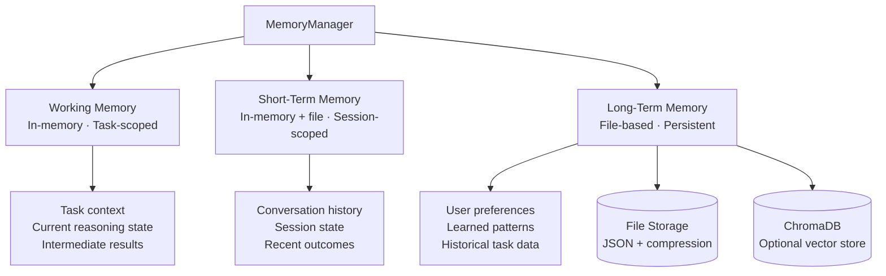

# 🧠 VoiceOS Memory Design

VoiceOS implements a three-tier memory system that enables agents to store, retrieve, and reason over information across tasks and sessions.

---

## Overview

Memory in VoiceOS is managed by `MemoryManager` (`memory/`) and wired into the orchestrator via `EventHandlers`. It operates transparently — agents automatically store task outcomes and retrieve relevant context without explicit memory management code in most flows.

**Key capabilities:**
- Session-scoped and persistent storage
- Category-based organization
- Semantic search (with optional vector embeddings)
- Automatic cleanup with configurable TTLs
- Privacy-first: all data stays local

---

## Memory Architecture



---

## Memory Tiers

### Tier 1: Working Memory

| Property | Value |
|---------|-------|
| **Scope** | Single task execution |
| **Storage** | In-process memory |
| **TTL** | End of task |
| **Size limit** | 10 MB per task |
| **Purpose** | Active task context, intermediate results, reasoning state |

Working memory is created per task and automatically discarded after completion or failure. It holds the current state of the autonomous loop (completed actions, current plan, partial results).

---

### Tier 2: Short-Term Memory

| Property | Value |
|---------|-------|
| **Scope** | Current session |
| **Storage** | In-memory + file backup |
| **TTL** | 24 hours after last access |
| **Size limit** | 100 MB per category |
| **Purpose** | Conversation context, recent task outcomes, session-specific state |

Short-term memory persists across multiple tasks within the same session. It enables VoiceOS to reference earlier conversation turns:

```
User: "Research quantum computing"
VoiceOS: [stores research summary in short-term memory]

User: "Now write a report based on that"
VoiceOS: [retrieves quantum computing research from short-term memory]
```

---

### Tier 3: Long-Term Memory

| Property | Value |
|---------|-------|
| **Scope** | Persistent across sessions |
| **Storage** | `workspace/memory/` (JSON + compression) |
| **TTL** | Configurable (never for high-importance entries) |
| **Size limit** | 1 GB total (configurable) |
| **Purpose** | User preferences, learned patterns, historical data |

Long-term memory survives process restarts. It stores user preferences, frequently-used patterns, and task artifacts that are worth retaining across sessions.

---

## Memory Data Structures

### MemoryEntry

```python
@dataclass
class MemoryEntry:
    key: str                          # Unique identifier
    value: Any                        # Stored value (string, dict, list, etc.)
    category: str                     # Logical category (see below)
    timestamp: datetime               # Creation time
    tags: List[str]                   # Searchable tags
    importance: float                 # 0.0 (low) to 1.0 (high)
    access_count: int                 # Number of times retrieved
    last_accessed: datetime           # Last retrieval time
    expires_at: Optional[datetime]    # None = never expires
```

### Memory Categories

| Category | TTL | Encryption | Use Case |
|---------|-----|-----------|---------|
| `conversation` | 24h | No | Chat history |
| `user_preferences` | Never | Yes | Settings and habits |
| `tool_results` | 7 days | No | Cached tool outputs |
| `learned_patterns` | Never | Yes | Behavioral patterns |
| `task_context` | End of task | No | Active task state |
| `research_cache` | 7 days | No | Web research results |
| `code_artifacts` | 30 days | No | Generated code files |
| `general` | 30 days | No | Miscellaneous data |

---

## Core Memory API

### MemoryManager

**Location**: `memory/memory_manager.py`

#### `store_memory(key, value, category, importance, tags)`

```python
def store_memory(
    key: str,
    value: Any,
    category: str = "general",
    importance: float = 0.5,
    tags: List[str] = None
) -> str
```

Store a value with automatic indexing.

**Example:**
```python
memory.store_memory(
    key="research_quantum_2024",
    value={"summary": "...", "sources": ["url1", "url2"]},
    category="research_cache",
    importance=0.7,
    tags=["quantum", "physics", "research"]
)
```

---

#### `retrieve_memory(key)`

```python
def retrieve_memory(key: str) -> Optional[Any]
```

Retrieve a value by exact key match.

**Example:**
```python
result = memory.retrieve_memory("research_quantum_2024")
if result:
    print(result["summary"])
```

---

#### `search_memories(query, category, limit)`

```python
def search_memories(
    query: str,
    category: Optional[str] = None,
    limit: int = 10
) -> List[MemoryEntry]
```

Full-text search across stored memories, optionally filtered by category.

**Example:**
```python
results = memory.search_memories("quantum computing", category="research_cache", limit=5)
for entry in results:
    print(f"{entry.key}: {entry.importance:.1f} importance")
```

---

#### `get_recent_memories(limit, category)`

```python
def get_recent_memories(
    limit: int = 10,
    category: Optional[str] = None
) -> List[MemoryEntry]
```

Get the most recently accessed or stored memories.

**Example:**
```python
recent = memory.get_recent_memories(limit=5, category="conversation")
for entry in recent:
    print(f"[{entry.timestamp}] {entry.key}")
```

---

#### `semantic_search(query, threshold)`

```python
def semantic_search(query: str, threshold: float = 0.7) -> List[MemoryEntry]
```

Search memories using vector similarity (requires ChromaDB + sentence-transformers installed).

**Example:**
```python
# Find memories semantically similar to the query
results = memory.semantic_search("machine learning models", threshold=0.6)
```

---

#### `update_memory(key, value, importance)`

```python
def update_memory(key: str, value: Any, importance: Optional[float] = None) -> bool
```

Update an existing memory entry's value and/or importance score.

---

#### `delete_memory(key)`

```python
def delete_memory(key: str) -> bool
```

Delete a memory entry by key.

---

#### `get_memories_by_timerange(start, end)`

```python
def get_memories_by_timerange(start: datetime, end: datetime) -> List[MemoryEntry]
```

Retrieve all memories created within a time window.

---

#### `cleanup_old_memories(max_age)`

```python
def cleanup_old_memories(max_age: timedelta) -> int
```

Delete all memories older than `max_age`. Returns count of deleted entries.

---

## Agent Memory Integration

### Automatic Memory in Orchestrator

`EventHandlers` (`core/events/event_handlers.py`) automatically stores task outcomes:

```python
# On TASK_COMPLETED event:
memory.store_memory(
    key=f"task_{task_id}_result",
    value={"goal": task.goal, "result": result.summary, "artifacts": result.files},
    category="tool_results",
    importance=0.6,
    tags=task.tags
)
```

### Agent Memory Interface

```python
class AgentMemory:
    """Per-agent memory interface with automatic context injection"""

    def store_context(self, context: Dict[str, Any]) -> None:
        """Save current agent reasoning context"""

    def get_context(self) -> Dict[str, Any]:
        """Retrieve saved agent context"""

    def store_learning(self, key: str, learning: Any) -> None:
        """Persist an insight or learned pattern"""

    def get_relevant_memories(self, query: str) -> List[MemoryEntry]:
        """Retrieve memories relevant to current task via search"""
```

### Context Injection

The `Orchestrator` automatically prepends relevant long-term memories to LLM prompts when `enable_agent_memory=True`:

```yaml
# config/voiceos.yaml
enable_agent_memory: true
```

This means agents can "remember" user preferences, past task patterns, and frequently-used configurations without any explicit memory management code.

---

## Storage Backends

### File-Based (Default)

```
workspace/memory/
├── short_term/
│   └── session_{date}.json.lz4     # Compressed session data
├── long_term/
│   ├── conversation.json.lz4
│   ├── user_preferences.json.lz4
│   └── learned_patterns.json.lz4
└── index/
    ├── category_index.json
    ├── tag_index.json
    └── temporal_index.json
```

- **Format**: JSON with LZ4 compression for fast I/O
- **Backup**: Automatic daily backup to `workspace/memory/backup/`

### ChromaDB (Optional — for Semantic Search)

Install the optional dependency:
```bash
pip install chromadb sentence-transformers
```

Enable in `config/memory.yaml`:
```yaml
memory:
  indexing:
    semantic_search: true
    vector_embeddings: true
```

ChromaDB stores vector embeddings for all memory entries, enabling `semantic_search()` queries.

---

## Memory Configuration

Full configuration in `config/memory.yaml`:

```yaml
memory:
  storage:
    backend: "file"          # file | database | hybrid
    path: "workspace/memory"
    compression: true
    encryption: false        # Set true to encrypt sensitive categories

  limits:
    total_size: "1GB"
    per_category: "100MB"
    per_task: "10MB"

  cleanup:
    auto_cleanup: true
    session_ttl: "24h"
    low_importance_ttl: "30d"    # Entries with importance < 0.3
    run_interval: "1h"           # How often to run cleanup

  indexing:
    full_text_search: true
    semantic_search: false        # Requires chromadb + sentence-transformers
    vector_embeddings: false

  performance:
    cache_size: "100MB"          # In-memory hot cache
    batch_size: 100              # Batch write size
    async_operations: true

categories:
  conversation:
    ttl: "24h"
    encryption: false

  user_preferences:
    ttl: "never"
    encryption: true

  tool_results:
    ttl: "7d"
    encryption: false

  learned_patterns:
    ttl: "never"
    encryption: true
```

---

## Memory Cleanup Policies

### Expiration Policy

| Condition | Action |
|---------|--------|
| Session memory after 24h | Auto-expire |
| Low importance (< 0.3) after 30 days | Auto-delete |
| High importance (> 0.8) | Never expire |
| User-explicit delete | Immediate removal |

### Eviction Order (when at capacity)

1. **Expired entries** — remove immediately
2. **LRU** — least recently accessed entries first
3. **Low importance** — entries with `importance < 0.3`
4. **Oldest** — chronologically oldest entries

### Manual Cleanup

```python
from memory.memory_manager import MemoryManager
from datetime import timedelta

memory = MemoryManager()

# Remove entries older than 7 days
deleted = memory.cleanup_old_memories(max_age=timedelta(days=7))
print(f"Cleaned up {deleted} entries")
```

---

## Privacy and Security

- **Local only** — All memory stays on your machine
- **No cloud sync** — Memory is never transmitted externally
- **User control** — Users can list, view, and delete any memory entry
- **Selective encryption** — Sensitive categories use AES-256 encryption at rest
- **Anonymization** — No PII is stored unless explicitly placed by the user

### Viewing and Managing Memory

```
"Show my recent memories"
"What do you remember about Python projects?"
"Forget the research about quantum computing"
"Clear all conversation memory"
```

---

## Planned Enhancements

| Feature | Status | Description |
|---------|--------|-------------|
| Vector database (ChromaDB) | Optional, available | Advanced semantic search |
| Memory graph | Planned | Relationship-based organization |
| Auto-tagging | Planned | LLM-powered automatic categorization |
| Distributed memory | Planned | Multi-node memory sharing via Redis |
| Memory analytics | Planned | Usage patterns and insights dashboard |
| Cross-session learning | Partial | Persistent patterns already stored |