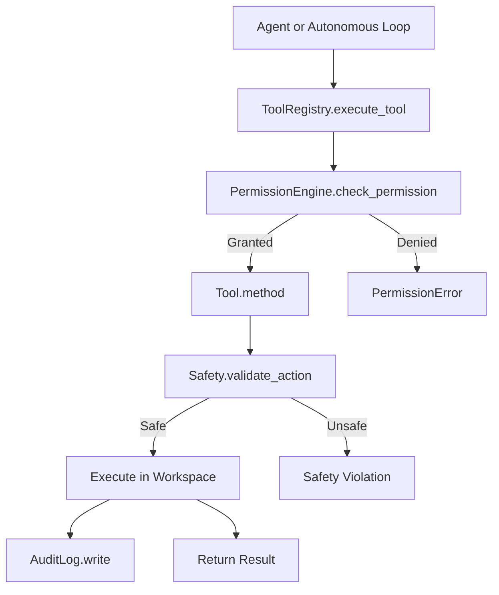

# 🔌 VoiceOS Tools Integration Guide

How to register, extend, and use tools within the VoiceOS system — including writing custom tools and integrating third-party capabilities.

---

## Overview

VoiceOS uses a **central Tool Registry** that all agents query to discover and execute capabilities. The five native tools (file, web, code, document, scheduler) are registered at startup. You can add your own tools by following this guide.

---

## Tool Architecture



---

## Using the Tool Registry

### Initialize and Access

```python
from tools.tool_registry import ToolRegistry

# Get the shared registry instance
registry = ToolRegistry()

# List all registered tools
tools = registry.list_tools()
print(tools)
# ['enhanced_file_manager', 'browser_tool', 'code_executor', ...]

# Get metadata for a tool
info = registry.get_tool_info("enhanced_file_manager")
print(info)
# {
#     "name": "enhanced_file_manager",
#     "category": "FILE_OPERATIONS",
#     "permission_level": "medium",
#     "methods": ["read_file", "write_file", "create_file", "delete_file", ...],
#     "version": "1.0.0"
# }
```

### Execute a Tool Programmatically

```python
# Async tool execution
result = await registry.execute_tool(
    tool_name="enhanced_file_manager",
    parameters={
        "method": "write_file",
        "path": "output/result.txt",
        "content": "Hello from VoiceOS!"
    }
)

result = await registry.execute_tool(
    tool_name="browser_tool",
    parameters={
        "method": "search_web",
        "query": "Python async programming",
        "max_results": 5
    }
)
```

### Register All Native Tools

```python
from tools.voiceos_tools_integration import initialize_voiceos_tools_integration
from tools.tool_registry import ToolRegistry

tool_registry = ToolRegistry()
integration = initialize_voiceos_tools_integration(tool_registry)
count = integration.register_voiceos_tools()
print(f"Registered {count} VoiceOS tools")
```

---

## Native Tool Instances

Pre-configured singleton instances are available for direct use:

```python
# File operations
from tools.file_tools.enhanced_file_manager import enhanced_file_manager

# Web browsing and search
from tools.web_tools.browser_tool import browser_tool

# Sandboxed code execution
from tools.code_tools.code_executor import code_executor

# Document processing
from tools.document_tools.document_processor import document_processor

# Task scheduling
from tools.scheduler_tools.task_scheduler import task_scheduler
```

---

## Writing a Custom Tool

### Step 1: Create the Tool File

```python
# tools/my_tools/my_custom_tool.py

from typing import Optional, Dict, Any
from permissions.permission_engine import check_permission, PermissionLevel
from core.logger import logger


class MyCustomTool:
    """
    Custom tool that does something useful.
    All methods that modify state or access external resources
    must be decorated with @check_permission.
    """

    TOOL_NAME = "my_custom_tool"
    CATEGORY = "UTILITY"
    VERSION = "1.0.0"

    def __init__(self, workspace_root: Optional[str] = None):
        """
        Initialize tool with workspace root.

        Args:
            workspace_root: Absolute path to workspace. Defaults to project_root/workspace.
        """
        from core.config import Config
        config = Config()
        self.workspace_root = workspace_root or str(config.workspace)
        self.logger = logger

    @check_permission(PermissionLevel.LOW)
    def get_status(self) -> Dict[str, Any]:
        """
        Get current tool status.

        Returns:
            Dict with status information
        """
        self.logger.log_tool_execution(
            tool_name=self.TOOL_NAME,
            method="get_status",
            result="success"
        )
        return {
            "success": True,
            "status": "ready",
            "tool": self.TOOL_NAME,
            "version": self.VERSION
        }

    @check_permission(PermissionLevel.MEDIUM)
    def do_something(self, input_data: str) -> Dict[str, Any]:
        """
        Perform the tool's main action.

        Args:
            input_data: Input to process

        Returns:
            Dict with result information

        Raises:
            ValueError: If input_data is invalid
            PermissionError: If user lacks required permission
        """
        if not input_data or not input_data.strip():
            raise ValueError("input_data cannot be empty")

        # Your tool logic here
        result = input_data.upper()  # Example transformation

        self.logger.log_tool_execution(
            tool_name=self.TOOL_NAME,
            method="do_something",
            result=result
        )

        return {
            "success": True,
            "result": result,
            "input_length": len(input_data),
            "output_length": len(result)
        }

    @check_permission(PermissionLevel.HIGH)
    def destructive_action(self, target: str) -> Dict[str, Any]:
        """
        Perform an irreversible action (requires HIGH permission + explicit approval).

        Args:
            target: What to act on

        Returns:
            Dict with result

        Raises:
            PermissionError: If user doesn't explicitly approve
        """
        # HIGH permission means user will be asked for explicit approval
        # This method won't execute unless they confirm

        self.logger.log_tool_execution(
            tool_name=self.TOOL_NAME,
            method="destructive_action",
            result=f"acted on {target}"
        )

        return {
            "success": True,
            "message": f"Action performed on: {target}"
        }


# Singleton instance for import
my_custom_tool = MyCustomTool()
```

---

### Step 2: Add Tool Metadata

Create a companion metadata class (optional but recommended for registry integration):

```python
# tools/my_tools/__init__.py

from tools.my_tools.my_custom_tool import MyCustomTool, my_custom_tool

TOOL_METADATA = {
    "name": "my_custom_tool",
    "description": "Custom tool that does something useful",
    "category": "UTILITY",
    "version": "1.0.0",
    "author": "Your Name",
    "methods": {
        "get_status": {
            "description": "Get current tool status",
            "permission": "LOW",
            "parameters": []
        },
        "do_something": {
            "description": "Perform the main action",
            "permission": "MEDIUM",
            "parameters": [
                {"name": "input_data", "type": "str", "required": True}
            ]
        }
    }
}
```

---

### Step 3: Register with VoiceOS

#### Option A: Register in `voiceos_tools_integration.py`

Edit `tools/voiceos_tools_integration.py` to include your tool:

```python
from tools.my_tools.my_custom_tool import MyCustomTool

class VoiceOSToolsIntegration:
    def register_voiceos_tools(self) -> int:
        # ... existing registrations ...

        # Add your tool
        self.tool_registry.register_tool(MyCustomTool)

        return count
```

#### Option B: Register Dynamically

```python
from tools.tool_registry import ToolRegistry
from tools.my_tools.my_custom_tool import MyCustomTool

registry = ToolRegistry()
success = registry.register_tool(MyCustomTool)
print(f"Tool registered: {success}")
```

#### Option C: Register via Plugin

If your tool is part of a plugin:

```python
class MyPlugin(VoiceOSPluginInterface):
    def get_tools(self):
        from tools.my_tools.my_custom_tool import MyCustomTool
        return [MyCustomTool]
```

---

### Step 4: Test Your Tool

```python
from tools.my_tools.my_custom_tool import my_custom_tool
from permissions.permission_engine import PermissionLevel, permission_engine

# Set permission level for testing
permission_engine.set_user_permission_level(PermissionLevel.MEDIUM)

# Test the tool
status = my_custom_tool.get_status()
assert status["success"] is True

result = my_custom_tool.do_something("hello world")
assert result["success"] is True
assert result["result"] == "HELLO WORLD"

print("All tests passed!")
```

---

## Permission Decorator Reference

Apply these decorators to every tool method that accesses resources:

```python
from permissions.permission_engine import check_permission, PermissionLevel

@check_permission(PermissionLevel.LOW)
def read_only_operation(self, ...):
    """Silent allow — no user prompt"""

@check_permission(PermissionLevel.MEDIUM)
def write_or_network_operation(self, ...):
    """User confirmation required"""

@check_permission(PermissionLevel.HIGH)
def destructive_or_exec_operation(self, ...):
    """Explicit approval required"""
```

---

## Tool Best Practices

### 1. Validate All Inputs

```python
def process(self, file_path: str, query: str) -> Dict[str, Any]:
    if not file_path:
        raise ValueError("file_path is required")
    if not query or not query.strip():
        raise ValueError("query cannot be empty")
    if len(query) > 10000:
        raise ValueError("query too long (max 10,000 characters)")
    # ... proceed safely
```

### 2. Enforce Workspace Boundaries

```python
import os
from pathlib import Path

def _validate_path(self, path: str) -> Path:
    """Ensure path is within workspace — raise ValueError if not."""
    workspace = Path(self.workspace_root).resolve()
    target = (workspace / path).resolve()

    if not str(target).startswith(str(workspace)):
        raise ValueError(f"Path '{path}' is outside workspace boundary")

    return target
```

### 3. Return Consistent Result Dicts

```python
# Always return a dict with at minimum: success, and either result or error
return {
    "success": True,
    "result": "...",
    # Optional fields:
    "execution_time": elapsed,
    "metadata": {...}
}

# On failure:
return {
    "success": False,
    "error": str(exception),
    "error_type": type(exception).__name__
}
```

### 4. Log All Operations

```python
self.logger.log_tool_execution(
    tool_name=self.TOOL_NAME,
    method="method_name",
    result=result_or_summary,
    error=None,                 # str if error occurred
    execution_time=elapsed_secs
)
```

### 5. Handle Errors Gracefully

```python
@check_permission(PermissionLevel.MEDIUM)
def safe_method(self, param: str) -> Dict[str, Any]:
    try:
        result = self._do_work(param)
        self.logger.log_tool_execution(
            tool_name=self.TOOL_NAME,
            method="safe_method",
            result="success"
        )
        return {"success": True, "result": result}
    except ValueError as e:
        self.logger.log_tool_execution(
            tool_name=self.TOOL_NAME,
            method="safe_method",
            result=None,
            error=str(e)
        )
        return {"success": False, "error": str(e), "error_type": "ValueError"}
    except Exception as e:
        self.logger.log_tool_execution(
            tool_name=self.TOOL_NAME,
            method="safe_method",
            result=None,
            error=str(e)
        )
        raise  # Re-raise unexpected errors
```

---

## Agent Tool Bridge

The `AgentToolBridge` connects agents to tools with type-specific capability filtering:

```python
from agents.agent_tool_integration import AgentToolBridge
from tools.tool_registry import ToolRegistry

bridge = AgentToolBridge(tool_registry=ToolRegistry())

# Get tools available for a specific agent type
researcher_tools = bridge.get_available_tools_for_agent("researcher")
# ['browser_tool', 'document_processor', 'enhanced_file_manager']

developer_tools = bridge.get_available_tools_for_agent("developer")
# ['code_executor', 'enhanced_file_manager', 'browser_tool']

# Execute a tool on behalf of an agent (with permission check and logging)
result = await bridge.execute_tool_for_agent(
    agent_type="researcher",
    tool_name="browser_tool",
    method_name="search_web",
    query="Python async programming",
    max_results=5
)
```

---

## Tool Categories

| Category | Value | Native Tools |
|---------|-------|-------------|
| File Operations | `FILE_OPERATIONS` | `EnhancedFileManager` |
| Web Operations | `WEB_OPERATIONS` | `BrowserTool` |
| Code Execution | `CODE_EXECUTION` | `CodeExecutor` |
| Document Processing | `DOCUMENT_PROCESSING` | `DocumentProcessor` |
| Task Scheduling | `TASK_SCHEDULING` | `TaskScheduler` |
| OS Control | `OS_CONTROL` | OS control modules |
| Communication | `COMMUNICATION` | Messaging plugins |
| Utility | `UTILITY` | Custom utilities |

Filter tools by category:
```python
from tools.tool_registry import ToolRegistry, ToolCategory

registry = ToolRegistry()
web_tools = registry.list_tools(category=ToolCategory.WEB_OPERATIONS)
```

---

## Audit Logging

All tool operations are automatically logged. Log files per tool:

| Tool | Log File |
|------|---------|
| `EnhancedFileManager` | `workspace/logs/file_operations.log` |
| `BrowserTool` | `workspace/logs/browser_operations.log` |
| `CodeExecutor` | `workspace/logs/code_execution.log` |
| `DocumentProcessor` | `workspace/logs/document_operations.log` |
| `TaskScheduler` | `workspace/logs/scheduler_operations.log` |
| Custom tools | `workspace/logs/tool_operations.log` |

Each log entry contains:
```json
{
    "timestamp": "2026-06-16T09:30:00Z",
    "tool_name": "enhanced_file_manager",
    "method": "write_file",
    "agent_type": "developer",
    "parameters": {"path": "output.txt"},
    "result": "success",
    "execution_time_ms": 15,
    "permission_level": "MEDIUM"
}
```

---

## Related Documentation

| Document | Link |
|---------|------|
| Tool API Reference | [tool_api.md](tool_api.md) |
| Full API Reference | [api_reference.md](api_reference.md) |
| Core Integration Systems | [core_integration_systems.md](core_integration_systems.md) |
| Agent System | [agents.md](agents.md) |
| Architecture | [architecture.md](architecture.md) |
